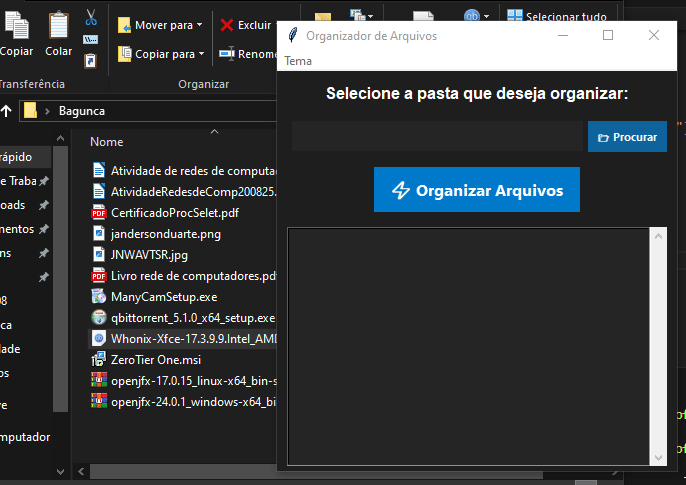
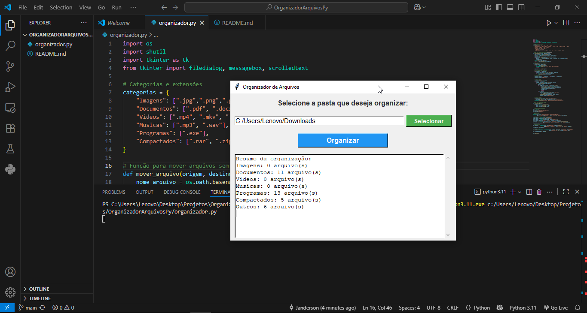

# 🗂 Organizador de Arquivos Python

[](https://www.python.org/)  
[](LICENSE)  

Um **organizador de arquivos para Windows**, desenvolvido em **Python** com **interface gráfica Tkinter**, que organiza automaticamente os arquivos em categorias, mantendo sua pasta limpa e organizada.  

---

## 🎯 Funcionalidades

- Organiza arquivos em categorias automaticamente:
  - 🖼 **Imagens**: `.jpg`, `.png`, `.gif`, `.jpeg`  
  - 📄 **Documentos**: `.pdf`, `.docx`, `.txt`, `.xlsx`, `.odt`, `.odp`, `.odb`, `.odg`  
  - 🎬 **Vídeos**: `.mp4`, `.mkv`, `.avi`  
  - 🎵 **Músicas**: `.mp3`, `.wav`  
  - 💻 **Programas**: `.exe`  
  - 🗜 **Compactados**: `.zip`, `.rar`, `.7z`, `.tar`, `.gz`, `.bz2`, `.xz`  
  - ❓ **Outros**: arquivos não categorizados  
- Evita sobrescrever arquivos já existentes (adiciona `(1)`, `(2)`, etc).  
- Mostra um resumo de quantos arquivos foram organizados em cada categoria.  
- Interface moderna, intuitiva e totalmente gratuita.  

---

## 🖼 Demonstração
<br>



---

## 💻 Como usar

1. Baixe o script `organizador.py`  
2. Abra o programa:  
   - `.py` → execute com Python 3:  
     ```bash
     python organizador.py
     ```  
   - `.exe` → clique duas vezes para abrir a GUI.  
3. Clique em **Selecionar** e escolha a pasta que deseja organizar.  
4. Clique em **Organizar** e aguarde a finalização.  
5. Confira o resumo na janela de saída.  

---

## ⚙️ Tecnologias

- Python 3  
- Tkinter (GUI)  
- Bibliotecas padrão: `os`, `shutil`  

---

## 🛠 Possíveis melhorias

- Adicionar novas categorias de arquivos.  
- Organizar por **data de criação** ou **tamanho do arquivo**.  
- Botão **Desfazer** para mover arquivos de volta.  
- Personalização de cores, fontes e layout da interface.  

---

## ✅ Contribuição

Projeto open-source!  
Sinta-se à vontade para abrir issues ou enviar pull requests com melhorias.  

---

## 📌 Projeto Para Estudos

Este projeto foi feito para estudos com auxílio de I.A:  
[Meu LinkedIn](https://www.linkedin.com/in/jandersonduarteabr)  

---

## 📝 Licença

MIT License © 2025 Janderson Duarte
